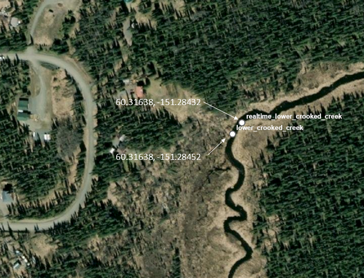

# Water Temperature Loggers

---
output:
  html_document: 
    df_print: paged
    fig_width: 10
    fig_height: 6
    fig_caption: yes
    code_folding: hide
    toc: true
    toc_depth: 4
    toc_float:
      collapsed: false
      smooth_scroll: false
editor_options: 
  chunk_output_type: inline
---

```{r , include=FALSE}
knitr::opts_chunk$set(echo = TRUE, warning = F, message = F)
# clear environment
rm(list=ls())

# load packages
library(bookdown)
library(tidyverse)
library(googlesheets4)
library(lubridate)
library(readr)
library(readxl)
library(writexl)
library(hms)
library(plotly)
library(DT)
library(xlsx)
library(leaflet)
library(DT)
library(ggpubr)
library(ggpmisc)
library(plotrix)
library(packrat)
library(foreign)

# set plotting themes

## geom_col plots theme
col_theme <- theme(axis.title = element_text(size = 14, face = "bold"),
                   strip.text = element_text(size = 14, face = "bold"),
                   legend.title = element_text(size = 14, face = "bold"),
                   legend.text = element_text(size = 14),
                   axis.text = element_text(size = 14))

## geom_points plots theme
points_theme <- theme(axis.title = element_text(size = 14, face = "bold"),
                   strip.text = element_text(size = 14, face = "bold"),
                   legend.title = element_text(size = 14, face = "bold"),
                   legend.text = element_text(size = 14),
                   axis.text = element_text(size = 11, face = "bold"),
                   title = element_text(size = 18))

# function to exclude multiple items per column
'%ni%' <- Negate('%in%')

# clarify select function
select <- dplyr::select
```

## Introduction

In addition to water temperature data collected via airborne thermal infrared imagery on July 20, 2020, we deployed water temperature loggers in the lower reach of each study stream in order to collect continuous time series of water temperature.

This section executes methods to visualize and perform basic quality checks on continuous temperature loggers deployed in the study streams.

We used Onset HOBO Temp Pro V2 loggers, deployed and maintained according to standards published in [Mauger et al. 2015](https://www.sciencedirect.com/science/article/pii/S2214581815000932 "link").

All data files (csv) used in this analysis can be downloaded from this project's [GitHub repository](https://github.com/Kenai-Watershed-Forum/kenai_thermal_imagery/tree/master/input).

```{r, echo = F}

# general intention: if mainistem is very warm, value of off-channel seeps all the more valuable

```

<br>

## Map

```{r, echo = F}
# general prep
## read in all site coordinates
coords <- read.csv("input/temperature_logger_data/site_metadata.csv") 
```

<br>

## Logger Data QA/QC

Data retrieved from the field was subjected to a basic quality assurance process before being incorporated into the final dataset. We visually inspected each water temperature time series and excluded data indicative of pre/post deployment or exposure. Figures \@ref(fig:pre-qa) and \@ref(fig:post-qa) provide a visual exampe of water temperature time series prior to and post quality assurance processes.

```{r, echo = F}
## read in logger data

# beaver creek
# we have logger data both from the KWF site and the nearby (~200 m upstream) UAA site

## read in KWF files
dir <- "input/temperature_logger_data/beaver_creek/csv_files/kwf/"
kwf_beaver_files <- list.files(dir)

kwf_beaver_creek <- list.files(path = dir,
              pattern="*.csv", 
              full.names = T) %>% 
    map_df(~read_csv(.)) %>%
  # assign new columns
  mutate(site = "kwf_beaver_creek",
         org = "KWF") %>%
  mutate(date_time = mdy_hms(paste(date, time))) %>%
  select(-date,-time) 

## read in UAA files
dir <- "input/temperature_logger_data/beaver_creek/csv_files/uaa/"
uaa_beaver_files <- list.files(dir)

uaa_beaver_creek <- list.files(path = dir,
              pattern="*.csv", 
              full.names = T) %>% 
    map_df(~read_csv(.)) %>%
  # correct format to match kwf files
  select(date_time,temp_C,logger_id) %>%
  transform(date_time = mdy_hm(date_time)) %>%
  # assign new columns
  mutate(site = "uaa_beaver_creek",
         org = "UAA") 
  
# combine UAA and KWF data to single dataframe, prep columns
beaver_creek <- bind_rows(kwf_beaver_creek,uaa_beaver_creek) 


# ******************************

# funny river

dir <- "input/temperature_logger_data/funny_river/csv_files"
funny_files <- list.files(dir)

funny_river <- list.files(path = dir,
              pattern="*.csv", 
              full.names = T) %>% 
    map_df(~read_csv(.)) %>%
  # assign new columns
  mutate(site = "funny_river",
         org = "KWF") %>%
  transform(date_time = mdy_hm(date_time))


# ******************************

# moose river

dir <- "input/temperature_logger_data/moose_river/csv_files"
moose_files <- list.files(dir)

moose_river <- list.files(path = dir,
              pattern="*.csv", 
              full.names = T) %>% 
    map_df(~read_csv(.)) %>%
  # assign new columns
  mutate(site = "moose_river",
         org = "KWF") %>%
  transform(date_time = mdy_hm(date_time))


# ******************************

# lower crooked creek

dir <- "input/temperature_logger_data/lower_crooked_creek/csv_files"
lower_crooked_files <- list.files(dir)

lower_crooked_creek <- list.files(path = dir,
              pattern="*.csv", 
              full.names = T) %>% 
    map_df(~read_csv(.)) %>%
  # assign new columns
  mutate(site = "lower_crooked_creek",
         org = "KWF") %>%
  transform(date_time = mdy_hm(date_time))


# ******************************
  
# lower crooked creek - real time logger (Beaded Stream)
# https://inletkeeper.org/our-work/healthy-habitat/real-time-temperature-sites/crooked-creek/
# download latest version of this file from inletkeeper site before republishing this document

# 10/27/2021

# in 2021, data streamed from site until 10/6/2021; after which the subscription expired. Requires subscription renewal to access further data.

# upon examining the data, it appears that 2017-08-14 14:43:00 is the date/time that data begins reliably streaming. remove data prior to this from dataset here.

original_start_time <- as.POSIXct("2017-08-14 14:43:00",origin = "1970-01-01")

dir <- "input/real_time_temp_sensor/"

lower_crooked_realtime_file <- as.character(list.files(dir))

lower_crooked_creek_realtime <- read_csv(paste0(dir,lower_crooked_realtime_file), skip = 3) %>%
  # assign new columns
  mutate(site = "lower_crooked_creek_realtime",
         org = "CIK",
         logger_id = "realtime") %>%
  filter(!is.na("Water Temp")) %>%
    # rename columns to match others
  rename("temp_C" = "Water Temp",
         "date_time" = "Transmit Time (AKDT)",
         "record_id" = "Record ID") %>%
  select(site,org,logger_id,temp_C,date_time,record_id) %>% 
  mutate(year = year(date_time)) %>%
  
  # remove erroneous year 2009 and 2010 values
  filter(date_time > original_start_time)  
  

# ******************************

# upper crooked creek

dir <- "input/temperature_logger_data/upper_crooked_creek/csv_files"
upper_crooked_files <- list.files(dir)

upper_crooked_creek <- list.files(path = dir,
              pattern="*.csv", 
              full.names = T) %>% 
    map_df(~read_csv(.)) %>%
  # assign new columns
  mutate(site = "upper_crooked_creek",
         org = "KWF") %>%
  transform(date_time = mdy_hm(date_time))


# ******************************
# ******************************
# ******************************

# combine data from all sites into single dataframe
dat <- bind_rows(beaver_creek,
                 funny_river,
                 moose_river,
                 lower_crooked_creek,
                 upper_crooked_creek) %>%
  transform(logger_id = as.character(logger_id)) %>%
  bind_rows(lower_crooked_creek_realtime) %>%
  mutate(day = yday(date_time),
         year = year(date_time)) %>%
  select(temp_C,logger_id,site,org,date_time,day,year) %>%
  distinct()

```

```{r pre-qa, fig.cap="Example of water temperature time series prior to quality assurance process", echo = F}

# Exclude segments of time series where loggers are exposed (pre/post deployment or low water)

# what are all our unique loggers?
loggers <- as.data.frame(unique(dat$logger_id))


# create ggplotly chart for each time series, one at a time, by remove hashtag from logger id

## double-hashtag indicates that visual inspection was performed and flagged data identified in "input/temperature_logger_data/flagged_data.csv". Single hashtag indicates that visual inspection has not yet been performed

## logger <-              "20012591"
## logger <-              "20635545"
## logger <-              "20861017"
## logger <-              "20861019"
## logger <-              "20861209"
## logger <-              "20861215"
## logger <-              "10816958"
## logger <-              "20635544"
## logger <-              "20861027"
## logger <-              "20861028"
## logger <-              "20012607"
## logger <-              "20012612"
## logger <-              "20861024"
## logger <-              "20861029"
## logger <-              "10816959"
## logger <-              "20012598"
logger <-              "20012594"
## logger <-              "20861018"
## logger <-              "20861022"
## logger <-              "20861016"
## logger <-              "20861023"
## logger <-              "realtime"
 

# plot
ggplotly(
  p <- dat %>%
  # modified site one at a time here to visually inspect datasets
  filter(logger_id == logger
         ) %>%
  
  ggplot(aes(date_time,temp_C, label = day)) +
  geom_point() +
  ggtitle(paste("Logger",logger, "pre-inspection")),
  # plot size
  height = 350, width = 600
  )


# mystery: the csv file for 20012591 exhibits odd behavior, shows multiple observations. source unclear 10/19/21. inspected csv files to no amend. excluded from analyses for now.

```

```{r, include = F}
# read in file of visually identified flagged data
flagged_data <- read.csv("input/temperature_logger_data/flagged_data.csv") %>%
  select(-notes)

# apply useData = 0 flags to flagged data
flagged_data <- inner_join(dat,flagged_data) %>%
  filter(day >= day_start & day <= day_stop) %>%
  mutate(useData = 0) %>%
  select(-day_start,-day_stop)

# apply useData = 1 to non-flagged data
nonflagged_data <- anti_join(dat,flagged_data) %>%
  mutate(useData = 1)

# rejoin flagged and non-flagged data in same dataframe
dat <- bind_rows(flagged_data,nonflagged_data)

```

<br>

```{r post-qa, fig.cap="Example of water temperature time series after quality assurance inspection", echo = F}
# create ggplotly chart with flagged data removed
ggplotly(
  p <- dat %>%
  # modified site one at a time here to visually inspect datasets
  filter(logger_id == logger,
         useData == 1
         ) %>%
  
  ggplot(aes(date_time,temp_C, label = day)) +
  geom_point() +
  ggtitle(paste("Logger",logger,"post-inspection")),
  height = 350, width = 600
  )

```

<br>

### Additional data preparation

#### Beaver Creek

Loggers at the Beaver Creek logger site were deployed in early summer 2020 by Kenai Watershed Forum. As part of a separate research project, University of Alaska Anchorage established a logger site several hundred meters upstream also in Summer 2020

We examined if data from the two sites are similar enough to use as a proxy for each other when data observations are missing. Time series from both sites are shown in figure \@ref(fig:bc-plots), and simultaneous values from both sites are presented in figure \@ref(fig:bc-reg).

```{r bc-data-prep, echo = F}

bc_dat <- dat %>%
  filter(site %in% c("kwf_beaver_creek","uaa_beaver_creek"),
         useData == 1) %>%
  group_by(site,date_time) %>%
  summarise(temp_C = mean(temp_C)) %>%
  pivot_wider(names_from = site, values_from = temp_C) %>%
  filter(!is.na(uaa_beaver_creek))
```

```{r bc-plots, echo = F, fig.cap = "Water temperature time series from Lower Beaver Creek at two nearby sites.", out.width = "70%", out.height="70%"}

bc_dat %>%
  pivot_longer(cols = c("kwf_beaver_creek","uaa_beaver_creek"), 
               names_to = "site", 
               values_to = "temp_C") %>%
  ggplot(aes(date_time,temp_C)) +
  facet_grid(site ~ .) +
  geom_point(size = 0.5) 
  
```

<br>

```{r bc-reg, echo = F, fig.cap = "Regression of simultaneous water temperature observations from two nearby sites in Beaver Creek.", out.width = "70%", out.height="70%"}
bc_dat %>%
  ggplot(aes(kwf_beaver_creek,uaa_beaver_creek)) +
  geom_point() +
  ylim(9,18) +
  geom_smooth(method = 'lm') +
  stat_poly_eq(formula = y ~ x, 
                aes(label = paste(..eq.label.., ..rr.label.., sep = "~~~")), 
                parse = TRUE) +
  labs(title = paste("Total observations: n =", nrow(bc_dat)))

```

```{r, echo = F}
bc_diff <- bc_dat %>%
  mutate(diff = abs(kwf_beaver_creek - uaa_beaver_creek)) %>%
  filter(!is.na(diff)) %>%
  summarise(avg_diff = mean(diff))
```

The average absolute difference in temperature between the two logger sites in Beaver Creek is `r bc_diff` C. For most applications, a substitution of data from either of these sistes in Lower Beaver Creek will still accurately represent water temperature.

<br>

#### Lower Crooked Creek

Lower Crooked Creek has two adjacent temperature monitoring locations within 20 m of each other. Further details on these two sites are described below, and figure \@ref(fig:cc-map) shows locations of the two sites.

```{r cc-map, echo = F, fig.cap = "Lower Crooked Creek temperature monitoring sites", out.height=300, out.height=300}



```

##### Lower Crooked Creek Real-time temperature monitoring site

Cook Inletkeeper maintains a site installed by Beaded Stream that records air and water temperature data in real-time and streams these data live at <https://inletkeeper.org/our-work/healthy-habitat/real-time-temperature-sites/crooked-creek/>. Data has been recorded and streamed from this site at hourly intervals since summer 2017.

Air and water temperature data from this location can be downloaded as a csv file directly from the above Inletkeeper web link. However, ***as of `r Sys.Date()` there is an error with the publicly available csv file***. The publicly available csv file has incorrect time stamps after 12/31/2019. Beaded Stream staff is aware of the error, and says the remedy will require an in-person visit to the field. In the mean time, [contact their staff](http://www.beadedstream.com/contact/) to request access to most current data.

The data with correct time stamps from 2017-08-15 to 2021-10-26, obtained directly from the internal Beaded Stream dashboard, is also available at this link from GitHub: [**Download Lower Crooked Creek Realtime Temperature Data**](https://github.com/Kenai-Watershed-Forum/kenai_thermal_imagery/tree/master/input/real_time_temp_sensor).

##### Lower Crooked Creek HOBO TempPro V2 logger site

As part of the thermal imagery project we installed a pair of HOBO Temp Pro V2 loggers at a location 20 m upstream from the real-time temperature logger site. Temperature is recorded at 15 minute intervals.

During a site visit on 7/28/2021, we discovered that this pair of loggers potentially resided within a previously unidentified cold water plume incoming from the river-left bank. It was unclear if the cold water seep was influencing the loggers.

In order to determine if HOBO logger data prior to 7/28/2021 is influenced by the seep, we performed the following steps:

From mid-summer 2020 to mid-summer 2021, this pair of loggers were

In progress here!!!

```{r}
# plot of loggers mid-summer 2020 to mid-summer 2021
z <- dat %>%
  filter(useData == 1,
         site == "lower_crooked_creek")

 zzz <- data.frame(unique(z$logger_id))

 # moved loggers:
 ## 20012598 = downstream
 ## 20012594 = upstream
 
 ### mean diff, correlation , etc

```

Fig of data from all sites - realtime - original site; below coldwater input - new site, above coldwater input

Is data prior to Summer 2021 from these loggers actually rep of mainstem temps, or better to use realtime site...

<br>

### Extent of water temperature time series

Figure \@ref(fig:extent-fig) displays temporal extent of currently available water temperature at each site

```{r extent-fig, fig.cap = "Temporal extent of water temperature logger data",echo = F}

dat %>%
  filter(useData == 1,
         !is.na(date_time)) %>%
  group_by(site) %>%
  summarise(start = min(date_time),
            stop = max(date_time)) %>%
  ggplot(aes(ymin = start,
             ymax = stop,
             x = site)) +
  geom_linerange() + 
  coord_flip()

```
