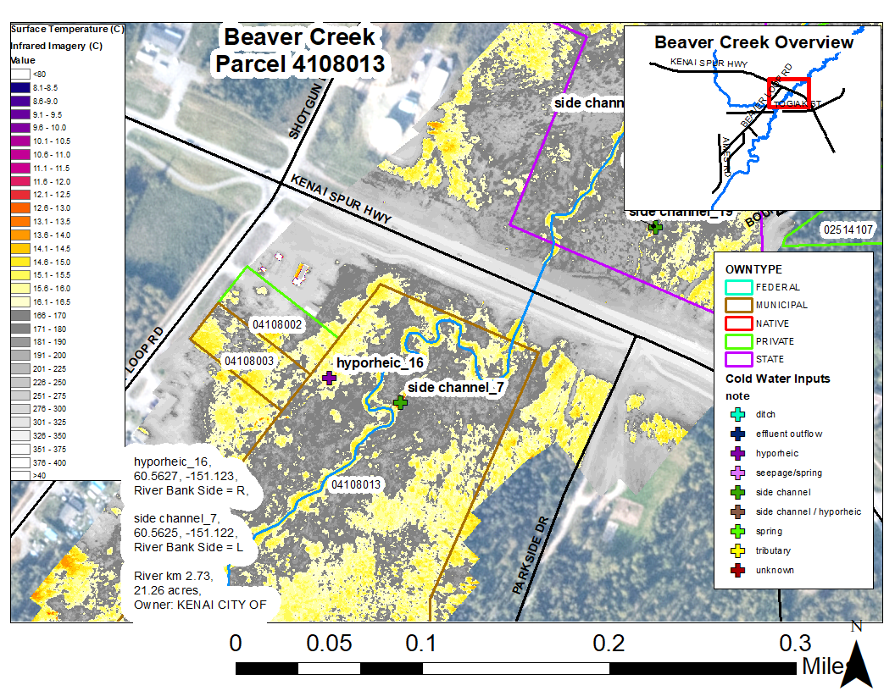
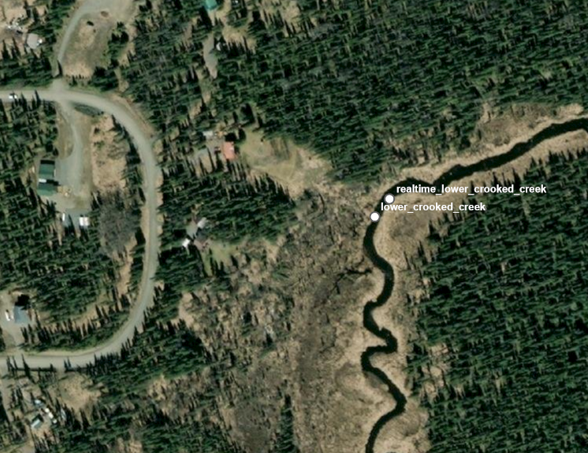

# Introduction

```{r , include=FALSE}
knitr::opts_chunk$set(echo = TRUE, warning = F, message = F)

# clear environment
rm(list=ls())

# load packages
library(bookdown)
library(tinytex)
library(tidyverse)
library(googlesheets4)
library(lubridate)
library(readr)
library(readxl)
library(writexl)
library(hms)
library(plotly)
library(DT)
library(xlsx)
library(leaflet)
library(DT)
library(ggpubr)
library(plotrix)
library(packrat)
library(foreign)

# set plotting themes

## geom_col plots theme
col_theme <- theme(axis.title = element_text(size = 14, face = "bold"),
                   strip.text = element_text(size = 14, face = "bold"),
                   legend.title = element_text(size = 14, face = "bold"),
                   legend.text = element_text(size = 14),
                   axis.text = element_text(size = 14))

## geom_points plots theme
points_theme <- theme(axis.title = element_text(size = 14, face = "bold"),
                   strip.text = element_text(size = 14, face = "bold"),
                   legend.title = element_text(size = 14, face = "bold"),
                   legend.text = element_text(size = 14),
                   axis.text = element_text(size = 11, face = "bold"),
                   title = element_text(size = 18))

# function to exclude multiple items per column
'%ni%' <- Negate('%in%')

# clarify select function
select <- dplyr::select
```

```{r TIR-fig, echo = F, fig.cap = "Example of airborne thermal infrared imagery showing temperature contrast in a stream near a road crossing", out.height=300, out.height=300}

knitr::include_graphics('images/example_TIR_img.jpg')

```

This document contains preliminary data and analysis related to the Kenai River Thermal Imagery project. This work is a collaborative effort between three Kenai Peninsula Nonprofits: Cook Inletkeeper, Kachemak Bay Heritage Land Trust, and Kenai Watershed Forum.

A two-page project summary titled, "Science Based Land Conservation: Cold Water Stepping Stones" is outlined below. A full size version of this information sheet is accessible at this link: [Project Summary Sheet Link](https://github.com/Kenai-Watershed-Forum/kenai_thermal_imagery/blob/master/documents/Kenai%20Thermal%20Imagery%20Project%20Overview%202021.pdf).

```{r , echo = F, fig.cap = "Project summary sheet", out.width=400, out.height=500}

knitr::include_graphics('images/project_summary_img.jpg')

```

```{r include=FALSE}
# automatically create a bib database for R packages
knitr::write_bib(c(
  .packages(), 'bookdown', 'knitr', 'rmarkdown'
), 'packages.bib')
```

<!--chapter:end:index.Rmd-->

# Project Map

The ArcGIS Online project map may be accessed below or at [ArcGIS Online (Click Here)](https://arcg.is/19Pqe0).

The online map contains layers with the following data:

-   Project Watershed Boundaries

-   National Hydrography Database (rivers, lakes, streams, etc)

-   Anadromous Waters Catalog

    -   Streams

    -   Lakes

-   Kenai Peninsula Borough Parcel Boundaries

-   Thermal Imagery Data from NV5 Geospatial consultants report

    -   Significant Thermal Features (identified from thermal imagery)

    -   Longitudinal Temperature Profiles (main channel temperatures of study streams)

    -   Water Temperature Logger Sites

```{=html}
<style>.embed-container {position: relative; padding-bottom: 80%; height: 0; max-width: 100%;} .embed-container iframe, .embed-container object, .embed-container iframe{position: absolute; top: 0; left: 0; width: 100%; height: 100%;} small{position: absolute; z-index: 40; bottom: 0; margin-bottom: -15px;}</style>
```
::: embed-container
<iframe width="500" height="400" frameborder="0" scrolling="no" marginheight="0" marginwidth="0" title="Kenai_Thermal_Imagery" src="//kwf.maps.arcgis.com/apps/Embed/index.html?webmap=2ec2c96346d94a90ac4b53f6134f6c4d&amp;extent=-152.1024,60.0586,-148.9218,60.7986&amp;home=true&amp;zoom=true&amp;previewImage=false&amp;scale=true&amp;search=true&amp;searchextent=false&amp;details=true&amp;legendlayers=true&amp;active_panel=legend&amp;basemap_gallery=true&amp;disable_scroll=true&amp;theme=light">

</iframe>
:::

<!--chapter:end:01-project_map.Rmd-->

```{r}

knitr::opts_chunk$set(echo = TRUE, warning = F, message = F)
knitr::opts_knit$set(progress=FALSE, verbose=FALSE)
# clear environment
rm(list=ls())

# load packages
library(bookdown)
library(rmarkdown)
library(tidyverse)
library(googlesheets4)
library(DT)
library(plotly)
library(kableExtra)
```

# Thermal Imagery Data

```{r TIR-fig1, echo = F, fig.cap = "Example of airborne thermal infrared imagery showing temperature contrast in a stream. A cold water inflow (purple and blue colors) enters the main channel (yellow color). Figure from NV5 Geospatial consultants report.", out.height=300, out.height=300}

knitr::include_graphics('images/example_TIR_figure.jpg')

```

### Introduction

On July 5, 2020, [NV5 Geospatial](https://www.nv5.com/geospatial/) collected thermal infrared imagery from a helicopter-mounted camera for four steams on the Kenai Peninsula in southern Alaska. These streams included:

-   Kenai River Tributaries

    -   Beaver Creek

    -   Funny River

    -   Moose River

-   Kasilof River Tributary

    -   Crooked Creek

All streams were flown during the afternoon hours in order to maximize the thermal contrast between the river's water and the banks.

The surveys extend for a total length of 59.1 km of the streams, covering upstream extents from their outlets at the Kenai or Kasilof rivers. The data were collected to aid the team in identifying the spatial variability in surface temperatures as well as thermal influence of point sources, tributaries, and surface springs.

Specific deliverables generated by NV5 Geospatial from the thermal imagery data include:

-   Rasters (map image files; .tif and .jpg formats)

-   Shapefiles (longitudinal temperature profiles, stream centerlines, others; .shp format)

-   Other supplemental items (coordinates of significant thermal features, maps and figures, and others)

The full technical report from NV5 Geospatial describing detailed methods and interpretation can be accessed at the following link:

-   [Kenai Rivers Thermal Infrared Airborne Imagery Technical Data Report (NV5 Geospatial)](https://github.com/Kenai-Watershed-Forum/kenai_thermal_imagery/blob/master/documents/TIR_Technical_Data_Report_Kenai_Rivers_20210107.pdf "Link")

The image raster files are of a large size (\~3 GB) and may be acquired by contacting staff at Cook Inletkeeper, Kenai Watershed Forum, or Kachemak Heritage Land Trust.

<br>

### Parcel data summary

We generated a table in GIS (ArcMap Pro 10.8.1) of parcels in the Kenai Peninsula Borough that intersect with cold-water inputs (e.g. seeps, springs) within the surveyed areas of Beaver Creek, Crooked Creek, Moose River, and Funny River.

```{r, include = F}

# Create table with information relevant for ground-truthing fieldwork

# read in a reduced set of columns
tbl1 <- read.csv("input/parcels/csv/parcel_and_significant_feature_intersect_1.csv") %>%
  select(Stream_Name,
         feature_type,
         feature_type,
         Latitude, Longitude,
         Site_Name,
         Rvr_mile,
         L_R_Bank,
         M_Off_str,   
         USAGE,
         SITUS_ADDR,
         ACREAGE,
         OWNER,
         OWNTYPE,
         PARCEL_ID,
         LANDVAL) 

# rename columns
names <- c("Stream_Name",
            "Feature_Type",
           "Latitude","Longitude",
           "Site_Name",
           "Rvr_Mile",
           "L_R_Bank",
           "M_off_str",
           "Usage",
           "Address",
           "Acres",
           "Owner",
           "Owner_Type",
           "Parcel ID",
           "Value")

colnames(tbl1) <- names

# prep order
tbl1 <- tbl1 %>%
  arrange(Stream_Name)


```

Figure \@ref(fig:parcel-plot) summarizes the ownership type of these parcels by general category of owner type.

<br>

```{r, include = F}
t <- tbl1 %>%
  count(Stream_Name,Owner_Type) 
```

<br>

```{r parcel-plot, fig.cap="Parcel ownership ", echo = FALSE}

ggplotly(
  p <- tbl1 %>%
    ggplot(aes(Stream_Name, fill = Owner_Type)) +
    geom_bar(position = position_dodge2(preserve = "single")) +
    xlab("") +
    ylab("Parcel Count") +
    ggtitle("Parcels Containing Thermal Features by Owner Type")
  )
```

<br>

### Ground truth data

On July 7-8, 2021 we visited a subset of sites containing significant thermal features identified in the NV5 Geospatial Consultants report. We visited 12 of 63 total sites. We recorded water temperatures of identified features as well as the main stem using a using a Hach Sension 5. We sketched the layout of the feature, and took site photos.

Field forms, including site sketches, can be accessed at the following link: [Thermal Imagery Ground Truthing Field Forms](https://github.com/Kenai-Watershed-Forum/kenai_thermal_imagery/blob/master/documents/Kenai%20TIR%20ground%20truthing%20datasheets.pdf).

Figure \@ref(fig:gt-data-plot) visualizes water temperature data sourced from the significant features in aerial imagery on July 20, 2020 alongside ground-truthed measurements from July 7-8, 2021.

```{r, echo = F}

## read in feature data

# read in a reduced set of columns
tbl1 <- read.csv("input/parcels/csv/parcel_and_significant_feature_intersect_1.csv") %>%
  select(Stream_Name,
         feature_type,
         Site_Name,
         Latitude, 
         Longitude,
         Mean,
         Median,
         Min,
         Std_Dev
        ) 

# rename columns
names <- c("Stream_Name",
           "Feature_Type",
            "Site_Name",
          "Latitude",
           "Longitude",
           "TIR_feature_temp_mean",
           "TIR_feature_temp_median",
           "TIR_feature_temp_min",
           "TIR_feature_temp_stdev"
           )

colnames(tbl1) <- names


## read in ground truth data
gt <- read_sheet("https://docs.google.com/spreadsheets/d/1NGnxuaW70K7ZFb-m4krSRx3WcKxHqhBRN-Muowr5HFc/edit#gid=1240916748", sheet = "Ground_Truthing") %>%
  select(Stream_Name,
         Site_Name,
         Date,
     #    Latitude,
     #    Longitude,
         GT_feature_temp_C,
         GT_mainstem_temp_C,
         GT_mainstem_cond,
         GT_feature_time,
         GT_mainstem_time) %>%
  rename("GT_Date" = "Date")


## join ground truthing data with TIR significant feature data
gt <- inner_join(tbl1,gt, by = c("Site_Name","Stream_Name")) 
```

```{r gt-data-plot, fig.cap="Thermal imagery ground truthing data. 'GT' indicates data is sourced from ground truthing; 'TIR' indicates data is sourced from aerial thermal imagery" , echo = FALSE}


#
gt_long <- gt %>%
  #select(-Stream_Name,-Feature_Type,-Latitude,-Longitude) %>%
  pivot_longer(cols = c("TIR_feature_temp_mean",   
                        "TIR_feature_temp_median", 
                        "TIR_feature_temp_min",
                        "TIR_feature_temp_stdev",
                        "GT_feature_temp_C",
                        "GT_mainstem_temp_C"
                      ),
               names_to = "stat",
               values_to = "val",
               values_drop_na = TRUE) %>%
  separate(stat,sep = "_",into = c("obs_type","hydro_type","c","stat_type"), remove = F) %>%
  mutate(stat_type = str_replace(stat_type,"C","observed")) %>%
  mutate(hydro_obs_type = paste0(obs_type,"_",hydro_type)) %>%
  select(-c) %>%
  filter(stat_type != "stdev")

#
ggplotly(
  p <- gt_long %>%
  ggplot() +
  facet_wrap(Stream_Name ~ Site_Name) +
  geom_point(aes(hydro_obs_type, val, shape = stat_type)) +
    theme(axis.text.x = element_text(angle = 75, hjust = 1)) +
    xlab("") +
    ylab("Water Temperature (C)") +
  theme(panel.spacing.y = unit(2, "lines"))
  )

```

<br>

### Collaborative Assessment

Researchers with participating organizations used data from several sources to assess conservation strategies within each study watershed, and recorded their notes on a shared platform. These collective notes are being used internally to inform strategy for outreach approaches with local property owners.

Data sources used to assess parcel-specific conservation strategies include:

-   Custom maps for each significant thermal feature, including information about the parcel or parcels that it occupies

-   Information about individual thermal features from the [NV5 Geospatial Consultants Report](https://github.com/Kenai-Watershed-Forum/kenai_river_thermal_imagery/blob/master/documents/TIR_Technical_Data_Report_Kenai_Rivers_20210107.pdf), including mean value and contrast with the main stem

-   The [ArcGIS Online project map](https://arcg.is/fzn14)

**Project collaborators may access the Thermal Imagery Database Google Sheet using the link below:**

**Link: [Thermal Imagery Collaborative Assessment](https://docs.google.com/document/d/1TZcTMBOL6WDCyvOODZlGeuCd-1sPWzYsurWtx7MJoUE/edit)**

An example map is shown in figure \@ref(fig:example-map).

```{r example-map, echo = F, fig.cap = "Example of airborne thermal infrared imagery map with parcel overlay", out.height=325, out.width=375}



```

<!--chapter:end:02-thermal_imagery_data.Rmd-->

# Water Temperature Loggers

---
output:
  html_document: 
    df_print: paged
    fig_width: 10
    fig_height: 6
    fig_caption: yes
    code_folding: hide
    toc: true
    toc_depth: 4
    toc_float:
      collapsed: false
      smooth_scroll: false
editor_options: 
  chunk_output_type: inline
---

```{r , include=FALSE}
knitr::opts_chunk$set(echo = TRUE, warning = F, message = F)
# clear environment
rm(list=ls())

# load packages
library(bookdown)
library(tidyverse)
library(googlesheets4)
library(lubridate)
library(readr)
library(readxl)
library(writexl)
library(hms)
library(plotly)
library(DT)
library(xlsx)
library(leaflet)
library(DT)
library(ggpubr)
library(ggpmisc)
library(plotrix)
library(packrat)
library(foreign)

# set plotting themes

## geom_col plots theme
col_theme <- theme(axis.title = element_text(size = 14, face = "bold"),
                   strip.text = element_text(size = 14, face = "bold"),
                   legend.title = element_text(size = 14, face = "bold"),
                   legend.text = element_text(size = 14),
                   axis.text = element_text(size = 14))

## geom_points plots theme
points_theme <- theme(axis.title = element_text(size = 14, face = "bold"),
                   strip.text = element_text(size = 14, face = "bold"),
                   legend.title = element_text(size = 14, face = "bold"),
                   legend.text = element_text(size = 14),
                   axis.text = element_text(size = 11, face = "bold"),
                   title = element_text(size = 18))

# function to exclude multiple items per column
'%ni%' <- Negate('%in%')

# clarify select function
select <- dplyr::select
```

## Introduction

In addition to water temperature data collected via airborne thermal infrared imagery on July 20, 2020, we deployed water temperature loggers in the lower reach of each study stream in order to collect continuous time series of water temperature.

This section executes methods to visualize and perform basic quality checks on continuous temperature loggers deployed in the study streams.

We used Onset HOBO Temp Pro V2 loggers, deployed and maintained according to standards published in [Mauger et al. 2015](https://www.sciencedirect.com/science/article/pii/S2214581815000932 "link").

All data files (csv) used in this analysis can be downloaded from this project's [GitHub repository](https://github.com/Kenai-Watershed-Forum/kenai_thermal_imagery/tree/master/input).

```{r, echo = F}

# general intention: if mainistem is very warm, value of off-channel seeps all the more valuable

```

<br>

## Map

```{r, echo = F}
# general prep
## read in all site coordinates
coords <- read.csv("input/temperature_logger_data/site_metadata.csv") 
```

<br>

## Logger Data QA/QC

Data retrieved from the field was subjected to a basic quality assurance process before being incorporated into the final dataset. We visually inspected each water temperature time series and excluded data indicative of pre/post deployment or exposure. Figures \@ref(fig:pre-qa) and \@ref(fig:post-qa) provide a visual exampe of water temperature time series prior to and post quality assurance processes.

```{r, echo = F}
## read in logger data

# beaver creek
# we have logger data both from the KWF site and the nearby (~200 m upstream) UAA site

## read in KWF files
dir <- "input/temperature_logger_data/beaver_creek/csv_files/kwf/"
kwf_beaver_files <- list.files(dir)

kwf_beaver_creek <- list.files(path = dir,
              pattern="*.csv", 
              full.names = T) %>% 
    map_df(~read_csv(.)) %>%
  # assign new columns
  mutate(site = "kwf_beaver_creek",
         org = "KWF") %>%
  mutate(date_time = mdy_hms(paste(date, time))) %>%
  select(-date,-time) 

## read in UAA files
dir <- "input/temperature_logger_data/beaver_creek/csv_files/uaa/"
uaa_beaver_files <- list.files(dir)

uaa_beaver_creek <- list.files(path = dir,
              pattern="*.csv", 
              full.names = T) %>% 
    map_df(~read_csv(.)) %>%
  # correct format to match kwf files
  select(date_time,temp_C,logger_id) %>%
  transform(date_time = mdy_hm(date_time)) %>%
  # assign new columns
  mutate(site = "uaa_beaver_creek",
         org = "UAA") 
  
# combine UAA and KWF data to single dataframe, prep columns
beaver_creek <- bind_rows(kwf_beaver_creek,uaa_beaver_creek) 


# ******************************

# funny river

dir <- "input/temperature_logger_data/funny_river/csv_files"
funny_files <- list.files(dir)

funny_river <- list.files(path = dir,
              pattern="*.csv", 
              full.names = T) %>% 
    map_df(~read_csv(.)) %>%
  # assign new columns
  mutate(site = "funny_river",
         org = "KWF") %>%
  transform(date_time = mdy_hm(date_time))


# ******************************

# moose river

dir <- "input/temperature_logger_data/moose_river/csv_files"
moose_files <- list.files(dir)

moose_river <- list.files(path = dir,
              pattern="*.csv", 
              full.names = T) %>% 
    map_df(~read_csv(.)) %>%
  # assign new columns
  mutate(site = "moose_river",
         org = "KWF") %>%
  transform(date_time = mdy_hm(date_time))


# ******************************

# lower crooked creek

dir <- "input/temperature_logger_data/lower_crooked_creek/csv_files"
lower_crooked_files <- list.files(dir)

lower_crooked_creek <- list.files(path = dir,
              pattern="*.csv", 
              full.names = T) %>% 
    map_df(~read_csv(.)) %>%
  # assign new columns
  mutate(site = "lower_crooked_creek",
         org = "KWF") %>%
  transform(date_time = mdy_hm(date_time))


# ******************************
  
# lower crooked creek - real time logger (Beaded Stream)
# https://inletkeeper.org/our-work/healthy-habitat/real-time-temperature-sites/crooked-creek/
# download latest version of this file from inletkeeper site before republishing this document

# 10/27/2021

# in 2021, data streamed from site until 10/6/2021; after which the subscription expired. Requires subscription renewal to access further data.

# upon examining the data, it appears that 2017-08-14 14:43:00 is the date/time that data begins reliably streaming. remove data prior to this from dataset here.

original_start_time <- as.POSIXct("2017-08-14 14:43:00",origin = "1970-01-01")

dir <- "input/real_time_temp_sensor/"

lower_crooked_realtime_file <- as.character(list.files(dir))

lower_crooked_creek_realtime <- read_csv(paste0(dir,lower_crooked_realtime_file), skip = 3) %>%
  # assign new columns
  mutate(site = "lower_crooked_creek_realtime",
         org = "CIK",
         logger_id = "realtime") %>%
  filter(!is.na("Water Temp")) %>%
    # rename columns to match others
  rename("temp_C" = "Water Temp",
         "date_time" = "Transmit Time (AKDT)",
         "record_id" = "Record ID") %>%
  select(site,org,logger_id,temp_C,date_time,record_id) %>% 
  mutate(year = year(date_time)) %>%
  
  # remove erroneous year 2009 and 2010 values
  filter(date_time > original_start_time)  
  

# ******************************

# upper crooked creek

dir <- "input/temperature_logger_data/upper_crooked_creek/csv_files"
upper_crooked_files <- list.files(dir)

upper_crooked_creek <- list.files(path = dir,
              pattern="*.csv", 
              full.names = T) %>% 
    map_df(~read_csv(.)) %>%
  # assign new columns
  mutate(site = "upper_crooked_creek",
         org = "KWF") %>%
  transform(date_time = mdy_hm(date_time))


# ******************************
# ******************************
# ******************************

# combine data from all sites into single dataframe
dat <- bind_rows(beaver_creek,
                 funny_river,
                 moose_river,
                 lower_crooked_creek,
                 upper_crooked_creek) %>%
  transform(logger_id = as.character(logger_id)) %>%
  bind_rows(lower_crooked_creek_realtime) %>%
  mutate(day = yday(date_time),
         year = year(date_time)) %>%
  select(temp_C,logger_id,site,org,date_time,day,year) %>%
  distinct()

```

```{r pre-qa, fig.cap="Example of water temperature time series prior to quality assurance process", echo = F}

# Exclude segments of time series where loggers are exposed (pre/post deployment or low water)

# what are all our unique loggers?
loggers <- as.data.frame(unique(dat$logger_id))


# create ggplotly chart for each time series, one at a time, by remove hashtag from logger id

## double-hashtag indicates that visual inspection was performed and flagged data identified in "input/temperature_logger_data/flagged_data.csv". Single hashtag indicates that visual inspection has not yet been performed

## logger <-              "20012591"
## logger <-              "20635545"
## logger <-              "20861017"
 logger <-              "20861019"
## logger <-              "20861209"
## logger <-              "20861215"
## logger <-              "10816958"
## logger <-              "20635544"
## logger <-              "20861027"
## logger <-              "20861028"
## logger <-              "20012607"
## logger <-              "20012612"
## logger <-              "20861024"
## logger <-              "20861029"
## logger <-              "10816959"
## logger <-              "20012598"
##logger <-              "20012594"
## logger <-              "20861018"
## logger <-              "20861022"
## logger <-              "20861016"
## logger <-              "20861023"
## logger <-              "realtime"
 

# plot
ggplotly(
  p <- dat %>%
  # modified site one at a time here to visually inspect datasets
  filter(logger_id == logger
         ) %>%
  
  ggplot(aes(date_time,temp_C, label = day)) +
  geom_point() +
  ggtitle(paste("Logger",logger, "pre-inspection")),
  # plot size
  height = 350, width = 600
  )


# mystery: the csv file for 20012591 exhibits odd behavior, shows multiple observations. source unclear 10/19/21. inspected csv files to no amend. excluded from analyses for now.

```

```{r, include = F}
# read in file of visually identified flagged data
flagged_data <- read.csv("input/temperature_logger_data/flagged_data.csv") %>%
  select(-notes)

# apply useData = 0 flags to flagged data
flagged_data <- inner_join(dat,flagged_data) %>%
  filter(day >= day_start & day <= day_stop) %>%
  mutate(useData = 0) %>%
  select(-day_start,-day_stop)

# apply useData = 1 to non-flagged data
nonflagged_data <- anti_join(dat,flagged_data) %>%
  mutate(useData = 1)

# rejoin flagged and non-flagged data in same dataframe
dat <- bind_rows(flagged_data,nonflagged_data)

```

<br>

```{r post-qa, fig.cap="Example of water temperature time series after quality assurance inspection", echo = F}
# create ggplotly chart with flagged data removed
ggplotly(
  p <- dat %>%
  # modified site one at a time here to visually inspect datasets
  filter(logger_id == logger,
         useData == 1
         ) %>%
  
  ggplot(aes(date_time,temp_C, label = day)) +
  geom_point() +
  ggtitle(paste("Logger",logger,"post-inspection")),
  height = 350, width = 600
  )

```

<br>

### Additional data preparation

#### Beaver Creek

Loggers at the Beaver Creek logger site were deployed in early summer 2020. As part of a separate research project, University of Alaska Anchorage established a logger site several hundred meters upstream also in Summer 2020

We examined if data from the two sites are similar enough to use as a proxy for each other when data observations are missing. Time series from both sites are shown in figure \@ref(fig:bc-plots), and simultaneous values from both sites are presented in figure \@ref(fig:bc-reg).

```{r bc-data-prep, echo = F}

bc_dat <- dat %>%
  filter(site %in% c("kwf_beaver_creek","uaa_beaver_creek"),
         useData == 1) %>%
  group_by(site,date_time) %>%
  summarise(temp_C = mean(temp_C)) %>%
  pivot_wider(names_from = site, values_from = temp_C) %>%
  filter(!is.na(uaa_beaver_creek))
```

```{r bc-plots, echo = F, fig.cap = "Water temperature time series from Lower Beaver Creek at two nearby sites.", out.width = "70%", out.height="70%"}

bc_dat %>%
  pivot_longer(cols = c("kwf_beaver_creek","uaa_beaver_creek"), 
               names_to = "site", 
               values_to = "temp_C") %>%
  ggplot(aes(date_time,temp_C)) +
  facet_grid(site ~ .) +
  geom_point(size = 0.5) +
  xlab("")
  
```

<br>

```{r bc-reg, echo = F, fig.cap = "Regression of simultaneous water temperature observations from two nearby sites in Beaver Creek.", out.width = "70%", out.height="70%"}
bc_dat %>%
  ggplot(aes(kwf_beaver_creek,uaa_beaver_creek)) +
  geom_point() +
  ylim(9,18) +
  geom_smooth(method = 'lm') +
  stat_poly_eq(formula = y ~ x, 
                aes(label = paste(..eq.label.., ..rr.label.., sep = "~~~")), 
                parse = TRUE) +
  labs(title = paste("Total observations: n =", nrow(bc_dat)))

```

```{r, echo = F}
# mean difference
bc_diff <- bc_dat %>%
  mutate(diff = abs(kwf_beaver_creek - uaa_beaver_creek)) %>%
  filter(!is.na(diff)) %>%
  summarise(avg_diff = mean(diff)) %>%
  as.numeric() %>%
  format(round(2), nsmall = 2)

# stdev of differnce
bc_diff_sd <- bc_dat %>%
  mutate(diff = abs(kwf_beaver_creek - uaa_beaver_creek)) %>%
  filter(!is.na(diff)) %>%
  summarise(sd_diff = sd(diff)) %>%
  as.numeric() %>%
  format(round(2), nsmall = 2)
```

The average absolute difference in temperature between the two logger sites in Beaver Creek is `r bc_diff` ± `r bc_diff_sd` C (mean ± sd). For most applications, a substitution of data from either of these sites in Lower Beaver Creek will still accurately represent water temperature.

<br>

#### Lower Crooked Creek

Lower Crooked Creek has two adjacent temperature monitoring locations within 20 m of each other. Further details on these two sites are described below, and figure \@ref(fig:cc-map) shows locations of the two sites.

```{r cc-map, echo = F, fig.cap = "Lower Crooked Creek temperature monitoring sites", out.height=300, out.height=300}



```

##### Lower Crooked Creek Real-time temperature monitoring site

Cook Inletkeeper maintains a site installed by Beaded Stream that records air and water temperature data in real-time and streams these data live at <https://inletkeeper.org/our-work/healthy-habitat/real-time-temperature-sites/crooked-creek/>. Water and air temperature data has been recorded and streamed from this site at hourly intervals since summer 2017.

Temperature data from this location can be downloaded as a csv file directly from the above Inletkeeper web link. However, ***as of `r Sys.Date()` there is an error with the publicly available csv file***. The publicly available csv file has incorrect time stamps after 12/31/2019. Beaded Stream staff is aware of the error, and says the remedy will require an in-person visit to the field. In the mean time, [contact their staff](http://www.beadedstream.com/contact/) to request access to most current data.

The data with correct time stamps from 2017-08-15 to 2021-10-26, obtained directly from the internal Beaded Stream dashboard, is also available at this link from GitHub: [**Download Lower Crooked Creek Realtime Temperature Data**](https://github.com/Kenai-Watershed-Forum/kenai_thermal_imagery/tree/master/input/real_time_temp_sensor).

##### Lower Crooked Creek HOBO TempPro V2 logger site

As part of the thermal imagery project, in Summer 2020 we installed a pair of HOBO Temp Pro V2 loggers at a location 20 m upstream from the real-time temperature logger site. Water temperature is recorded at 15 minute intervals.

During a site visit on 7/28/2021, we discovered that this pair of loggers potentially resided within a small, previously unidentified cold water plume incoming from the river-left bank. It was unclear if the local cold water seep was influencing the loggers in way such that they would not represent main channel temperature.

In order to determine if HOBO logger data prior to 7/28/2021 is influenced by the seep, we performed the following steps:


```{r cc-plots, echo = F, fig.cap = "Water temperature time series from Lower Crooked Creek at two nearby loggers (~5 m apart). a.) Upstream of a small coldwater tributary, b.) downstream of small coldwater tributary, c.) difference values between the loggers.", out.width = "70%", out.height="70%"}

# plot of loggers mid-summer 2020 to mid-summer 2021

# according to paper field form records, logger id #20012594 was installed in the upstream position after 7/29/2021 14:30:00. Thus all other spreadsheet files are from loggers in the "downstream" position

lcc_dat <- dat %>%
  filter(useData == 1,
         site == "lower_crooked_creek", 
         !is.na(temp_C)) %>%
  # assign position relative to the cold water seep
  mutate(position = ifelse(logger_id == "20012594","upstream","downstream")) %>%
  
  # create average temperatures where observations are paired from side by side loggers
  group_by(date_time,position) %>%
  summarise(avg_temp_C = mean(temp_C, na.rm = T)) %>%

  # calculate difference values where simultaneous observations exist in different locations
  pivot_wider(names_from = "position", values_from = "avg_temp_C") %>%
  mutate(diff = downstream - upstream) %>%
  
  # restructure dataframe for plot
  pivot_longer(cols = c("upstream", "downstream", "diff"), names_to = "data_type", values_to = "val") %>%
  filter(!is.na(val))

# specify order of facets
lcc_dat$data_type = factor(lcc_dat$data_type, levels=c("upstream","downstream","diff"))
  

# plot two sites & difference values

## facet labels
dat_types <- c(upstream = "a.) Upstream\nlogger",
               downstream = "b.) Downstream\nlogger",
               diff = "c.) Difference\nbetween loggers")


## plot
ggplotly(
  p <- lcc_dat %>%
  ggplot(aes(date_time,val)) +
  geom_line(size = 0.5) +
  facet_grid(data_type ~ ., scales = "free_y", labeller = as_labeller(dat_types)) +
  xlab("") +
  ylab("Temperature value (C)") +
  ggtitle("Lower Crooked Creek Hobo Loggers & Difference Values 2020 - 2021") +
  theme(strip.text.y = element_text(angle = 360))
)

  
```

a.) *Relocated loggers.* On 7/28/2021, we modified logger deployment such that one logger was directly upstream of the cold water seep, and one remained in its original location within the seep.

b.) *Compared temperature data upstream vs. downstream of the seep.*  We observed consistently cooler temperatures in the downstream logger, with an average difference of `r lcc_avg_diff` ± `r lcc_sd_diff` C, mean ± sd). Figure \@ref(fig:cc-plots) displays time series from both loggers as well as the difference values where simultaneous data exists.

From these data we observe that the small cold water tributary consistently affected main stem tempeature where the downstream 


```{r, echo = F}
lcc_diffs <- dat %>%
  filter(useData == 1,
         site == "lower_crooked_creek", 
         !is.na(temp_C)) %>%
  # assign position relative to the cold water seep
  mutate(position = ifelse(logger_id == "20012594","upstream","downstream")) %>%
  
  # create average temperatures where observations are paired from side by side loggers
  group_by(date_time,position) %>%
  summarise(avg_temp_C = mean(temp_C, na.rm = T)) %>%

  # calculate difference values where simultaneous observations exist
  pivot_wider(names_from = "position", values_from = "avg_temp_C") %>%
  mutate(diff = downstream - upstream) %>%
  filter(!is.na(diff)) %>%

# calculate stats on difference values
  ungroup() %>%
  summarise(avg_diff = mean(diff),
            sd_diff = sd(diff),
            max_abs_diff = max(abs(diff)),
            min_abs_diff = min(abs(diff)))

# create values for inline code chunks
lcc_avg_diff <- format(round(lcc_diffs$avg_diff,2), nsmall = 2)
lcc_sd_diff <- format(round(lcc_diffs$sd_diff,2), nsmall = 2)
lcc_max_abs_diff <- format(round(lcc_diffs$max_abs_diff,2), nsmall = 2)

```


build book error here!


<br>

### Extent of water temperature time series

Figure \@ref(fig:extent-fig) displays temporal extent of currently available water temperature at each site

```{r extent-fig, fig.cap = "Temporal extent of water temperature logger data",echo = F}

dat %>%
  filter(useData == 1,
         !is.na(date_time)) %>%
  group_by(site) %>%
  summarise(start = min(date_time),
            stop = max(date_time)) %>%
  ggplot(aes(ymin = start,
             ymax = stop,
             x = site)) +
  geom_linerange() + 
  coord_flip()

```

<!--chapter:end:03-temperature_loggers.Rmd-->

# Applications

Some _significant_ applications are demonstrated in this chapter.

## Example one

## Example two

<!--chapter:end:04-application.Rmd-->

# Final Words

We have finished a nice book.

<!--chapter:end:05-summary.Rmd-->

`r if (knitr:::is_html_output()) '
# References {-}
'`

<!--chapter:end:06-references.Rmd-->

