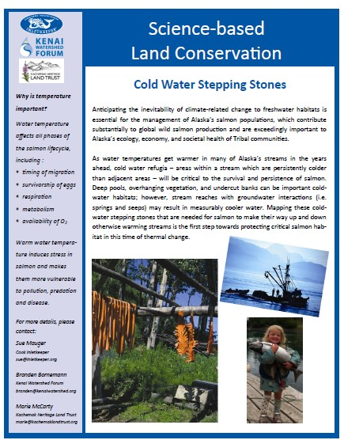
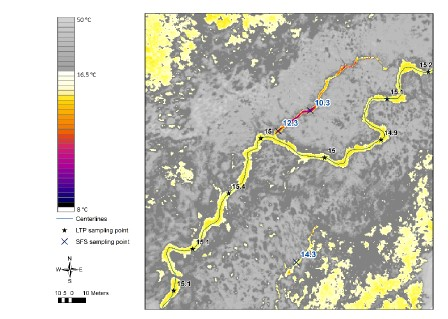

---
title: "Kenai River Thermal Imagery"
author: "Benjamin Meyer (ben@kenaiwatershed.org)"
date: "`r Sys.Date()`"
site: bookdown::bookdown_site
documentclass: book
bibliography: [book.bib, packages.bib]
biblio-style: apalike
link-citations: yes
description: "This document contains describes several data management and analysis tasks related to the Kenai River Thermal Imagery project."
---

# Introduction

```{r , include=FALSE}
knitr::opts_chunk$set(echo = TRUE, warning = F, message = F)

# clear environment
rm(list=ls())

# load packages
library(bookdown)
library(tinytex)
library(tidyverse)
library(googlesheets4)
library(lubridate)
library(readr)
library(readxl)
library(writexl)
library(hms)
library(plotly)
library(DT)
library(xlsx)
library(leaflet)
library(DT)
library(ggpubr)
library(plotrix)
library(packrat)
library(foreign)

# set plotting themes

## geom_col plots theme
col_theme <- theme(axis.title = element_text(size = 14, face = "bold"),
                   strip.text = element_text(size = 14, face = "bold"),
                   legend.title = element_text(size = 14, face = "bold"),
                   legend.text = element_text(size = 14),
                   axis.text = element_text(size = 14))

## geom_points plots theme
points_theme <- theme(axis.title = element_text(size = 14, face = "bold"),
                   strip.text = element_text(size = 14, face = "bold"),
                   legend.title = element_text(size = 14, face = "bold"),
                   legend.text = element_text(size = 14),
                   axis.text = element_text(size = 11, face = "bold"),
                   title = element_text(size = 18))

# function to exclude multiple items per column
'%ni%' <- Negate('%in%')

# clarify select function
select <- dplyr::select
```

```{r TIR-fig, echo = F, fig.cap = "Example of airborne thermal infrared imagery showing temperature contrast in a stream at a road crossing", out.height=300, out.height=300}

knitr::include_graphics('images/example_TIR_img.jpg')

```

This document contains preliminary data and analysis related to the Kenai River Thermal Imagery project. This work is a collaborative effort between three Kenai Peninsula Nonprofits: Cook Inletkeeper, Kachemak Bay Heritage Land Trust, and Kenai Watershed Forum.

A two-page project summary titled, "Science Based Land Conservation: Cold Water Stepping Stones" is outlined below. A full size version of this information sheet is accessible at this link: [Project Summary Sheet Link](https://github.com/Kenai-Watershed-Forum/kenai_river_thermal_imagery/blob/master/documents/Kenai%20Thermal%20Imagery%20Project%20Overview%202021.pdf).

```{r , echo = F, fig.cap = "Project summary sheet", out.width=400, out.height=500}



```


```{r include=FALSE}
# automatically create a bib database for R packages
knitr::write_bib(c(
  .packages(), 'bookdown', 'knitr', 'rmarkdown'
), 'packages.bib')
```

<!--chapter:end:index.Rmd-->

# Project Map

The ArcGIS Online project map may be accessed below or at [ArcGIS Online (Click Here)](https://arcg.is/19Pqe0).

The online map contains layers with the following data:

-   Project Watershed Boundaries

-   National Hydrography Database (rivers, lakes, streams, etc)

-   Anadromous Waters Catalog

    -   Streams

    -   Lakes

-   Kenai Peninsula Borough Parcel Boundaries

-   Thermal Imagery Data from NV5 Geospatial consultants report

    -   Significant Thermal Features (identified from thermal imagery)

    -   Longitudinal Temperature Profiles (main channel temperatures of study streams)

    -   Water Temperature Logger Sites

```{=html}
<style>.embed-container {position: relative; padding-bottom: 80%; height: 0; max-width: 100%;} .embed-container iframe, .embed-container object, .embed-container iframe{position: absolute; top: 0; left: 0; width: 100%; height: 100%;} small{position: absolute; z-index: 40; bottom: 0; margin-bottom: -15px;}</style>
```
::: embed-container
<iframe width="500" height="400" frameborder="0" scrolling="no" marginheight="0" marginwidth="0" title="Kenai_Thermal_Imagery" src="//kwf.maps.arcgis.com/apps/Embed/index.html?webmap=2ec2c96346d94a90ac4b53f6134f6c4d&amp;extent=-152.1024,60.0586,-148.9218,60.7986&amp;home=true&amp;zoom=true&amp;previewImage=false&amp;scale=true&amp;search=true&amp;searchextent=false&amp;details=true&amp;legendlayers=true&amp;active_panel=legend&amp;basemap_gallery=true&amp;disable_scroll=true&amp;theme=light">

</iframe>
:::

Note: due to the 

<!--chapter:end:01-project_map.Rmd-->

```{r}

knitr::opts_chunk$set(echo = TRUE, warning = F, message = F)
knitr::opts_knit$set(progress=FALSE, verbose=FALSE)
# clear environment
rm(list=ls())

# load packages
library(bookdown)
library(rmarkdown)
library(tidyverse)
library(googlesheets4)
library(DT)
library(plotly)
library(kableExtra)
```

# Thermal Imagery Data

```{r TIR-fig1, echo = F, fig.cap = "Example of airborne thermal infrared imagery showing temperature contrast in a stream. A cold water inflow (purple and blue colors) enters the main channel (yellow color). Figure from NV5 Geospatial consultants report.", out.height=300, out.height=300}



```

### Introduction

On July 5, 2020, [NV5 Geospatial](https://www.nv5.com/geospatial/) collected thermal infrared imagery from a helicopter-mounted camera for four steams on the Kenai Peninsula in southern Alaska. These streams included:

-   Kenai River Tributaries

    -   Beaver Creek

    -   Funny River

    -   Moose River

-   Kasilof River Tributary

    -   Crooked Creek

All streams were flown during the afternoon hours in order to maximize the thermal contrast between the river's water and the banks.

The surveys extend for a total length of 59.1 km of the streams, covering upstream extents from their outlets at the Kenai or Kasilof rivers. The data were collected to aid the team in identifying the spatial variability in surface temperatures as well as thermal influence of point sources, tributaries, and surface springs.

Specific deliverables generated by NV5 Geospatial from the thermal imagery data include:

-   Rasters (map image files; .tif and .jpg formats)

-   Shapefiles (longitudinal temperature profiles, stream centerlines, others; .shp format)

-   Other supplemental items (coordinates of significant thermal features, maps and figures, and others)

The full technical report from NV5 Geospatial describing detailed methods and interpretation can be accessed at the following link:

-   [Kenai Rivers Thermal Infrared Airborne Imagery Technical Data Report (NV5 Geospatial)](https://github.com/Kenai-Watershed-Forum/kenai_river_thermal_imagery/blob/master/documents/TIR_Technical_Data_Report_Kenai_Rivers_20210107.pdf "Link")

The image raster files are of a large size (\~3 GB) and may be acquired by contacting staff at Cook Inletkeeper, Kenai Watershed Forum, or Kachemak Heritage Land Trust.

<br>

### Parcel data summary

We generated a table in GIS (ArcMap Pro 10.8.1) of data describing where the cold-water features (e.g. seeps, springs) intersect with property parcels within the surveyed areas of Beaver Creek, Crooked Creek, Moose River, and Funny River.

```{r, include = F}

# Create table with information relevant for ground-truthing fieldwork

# read in a reduced set of columns
tbl1 <- read.csv("input/parcels/csv/parcel_and_significant_feature_intersect_1.csv") %>%
  select(Stream_Name,
         feature_type,
         feature_type,
         Latitude, Longitude,
         Site_Name,
         Rvr_mile,
         L_R_Bank,
         M_Off_str,   
         USAGE,
         SITUS_ADDR,
         ACREAGE,
         OWNER,
         OWNTYPE,
         PARCEL_ID,
         LANDVAL) 

# rename columns
names <- c("Stream_Name",
            "Feature_Type",
           "Latitude","Longitude",
           "Site_Name",
           "Rvr_Mile",
           "L_R_Bank",
           "M_off_str",
           "Usage",
           "Address",
           "Acres",
           "Owner",
           "Owner_Type",
           "Parcel ID",
           "Value")

colnames(tbl1) <- names

# prep order
tbl1 <- tbl1 %>%
  arrange(Stream_Name)


```

Figure \@ref(fig:parcel-plot) summarizes the ownership type of parcels identified to contain thermal features within each watershed.

<br>

```{r, include = F}
t <- tbl1 %>%
  count(Stream_Name,Owner_Type) 
```

<br>

```{r parcel-plot, fig.cap="Parcel ownership ", echo = FALSE}

ggplotly(
  p <- tbl1 %>%
    ggplot(aes(Stream_Name, fill = Owner_Type)) +
    geom_bar(position = position_dodge2(preserve = "single")) +
    xlab("") +
    ylab("Parcel Count") +
    ggtitle("Parcels Containing Thermal Features by Owner Type")
  )
```

<br>

### Ground truth data

On July 7-8, 2021 we visited a subset of sites containing significant thermal features identified in the NV5 Geospatial Consultants report. We visited 12 of 63 total sites. We recorded water temperatures of identified features as well as the main stem using a using a Hach Sension 5. We sketched the layout of the feature, and took site photos.

Field forms, including site sketches, can be accessed at the following link: [Thermal Imagery Ground Truthing Field Forms](https://github.com/Kenai-Watershed-Forum/kenai_thermal_imagery/blob/master/documents/Kenai%20TIR%20ground%20truthing%20datasheets.pdf).

Figure \@ref(fig:gt-data-plot) visualizes water temperature data sourced from the significant features as in aerial imagery on July 20, 2020 alongside ground truthed measurements from July 7-8, 2021.

```{r, echo = F}

## read in feature data

# read in a reduced set of columns
tbl1 <- read.csv("input/parcels/csv/parcel_and_significant_feature_intersect_1.csv") %>%
  select(Stream_Name,
         feature_type,
         Site_Name,
         Latitude, 
         Longitude,
         Mean,
         Median,
         Min,
         Std_Dev
        ) 

# rename columns
names <- c("Stream_Name",
           "Feature_Type",
            "Site_Name",
          "Latitude",
           "Longitude",
           "TIR_feature_temp_mean",
           "TIR_feature_temp_median",
           "TIR_feature_temp_min",
           "TIR_feature_temp_stdev"
           )

colnames(tbl1) <- names


## read in ground truth data
gt <- read_sheet("https://docs.google.com/spreadsheets/d/1NGnxuaW70K7ZFb-m4krSRx3WcKxHqhBRN-Muowr5HFc/edit#gid=1240916748", sheet = "Ground_Truthing") %>%
  select(Stream_Name,
         Site_Name,
         Date,
     #    Latitude,
     #    Longitude,
         GT_feature_temp_C,
         GT_mainstem_temp_C,
         GT_mainstem_cond,
         GT_feature_time,
         GT_mainstem_time) %>%
  rename("GT_Date" = "Date")


## join ground truthing data with TIR significant feature data
gt <- inner_join(tbl1,gt, by = c("Site_Name","Stream_Name")) 
```

```{r gt-data-plot, fig.cap="Thermal imagery ground truthing data. 'GT' indicates data is sourced from ground truthing; 'TIR' indicates data is sourced from aerial thermal imagery" , echo = FALSE}


#
gt_long <- gt %>%
  #select(-Stream_Name,-Feature_Type,-Latitude,-Longitude) %>%
  pivot_longer(cols = c("TIR_feature_temp_mean",   
                        "TIR_feature_temp_median", 
                        "TIR_feature_temp_min",
                        "TIR_feature_temp_stdev",
                        "GT_feature_temp_C",
                        "GT_mainstem_temp_C"
                      ),
               names_to = "stat",
               values_to = "val",
               values_drop_na = TRUE) %>%
  separate(stat,sep = "_",into = c("obs_type","hydro_type","c","stat_type"), remove = F) %>%
  mutate(stat_type = str_replace(stat_type,"C","observed")) %>%
  mutate(hydro_obs_type = paste0(obs_type,"_",hydro_type)) %>%
  select(-c) %>%
  filter(stat_type != "stdev")

#
ggplotly(
  p <- gt_long %>%
  ggplot() +
  facet_wrap(Stream_Name ~ Site_Name) +
  geom_point(aes(hydro_obs_type, val, shape = stat_type)) +
    theme(axis.text.x = element_text(angle = 75, hjust = 1)) +
    xlab("") +
    ylab("Water Temperature (C)") +
  theme(panel.spacing.y = unit(2, "lines"))
  )

```


<br>

### Collaborative Assessment

Researchers with participating organizations used data from several sources to assess conservation strategies within each study watershed, and recorded their notes on a shared platform. These collective notes are being used internally to inform strategy for outreach approaches with local property owners.

Data sources used to assess parcel-specific conservation strategies include:

-   Custom maps for each significant thermal feature, including information about the parcel or parcels that it occupies

-   Information about individual thermal features from the [NV5 Geospatial Consultants Report](https://github.com/Kenai-Watershed-Forum/kenai_river_thermal_imagery/blob/master/documents/TIR_Technical_Data_Report_Kenai_Rivers_20210107.pdf), including mean value and contrast with the main stem

-   The [ArcGIS Online project map](https://arcg.is/fzn14)

**Project collaborators may access the Thermal Imagery Database Google Sheet using the link below:**

**Link: [Thermal Imagery Collaborative Assessment](https://docs.google.com/document/d/1TZcTMBOL6WDCyvOODZlGeuCd-1sPWzYsurWtx7MJoUE/edit)**

An example map is shown in figure \@ref(fig:example-map).

```{r example-map, echo = F, fig.cap = "Example of airborne thermal infrared imagery map with parcel overlay", out.height=325, out.width=375}

knitr::include_graphics('images/Beaver_Crk4.png')

```

<!--chapter:end:02-thermal_imagery_data.Rmd-->

# Water Temperature Loggers

---
output:
  html_document: 
    df_print: paged
    fig_width: 10
    fig_height: 6
    fig_caption: yes
    code_folding: hide
    toc: true
    toc_depth: 4
    toc_float:
      collapsed: false
      smooth_scroll: false
editor_options: 
  chunk_output_type: inline
---

```{r , include=FALSE}
knitr::opts_chunk$set(echo = TRUE, warning = F, message = F)
# clear environment
rm(list=ls())

# load packages
library(bookdown)
library(tidyverse)
library(googlesheets4)
library(lubridate)
library(readr)
library(readxl)
library(writexl)
library(hms)
library(plotly)
library(DT)
library(xlsx)
library(leaflet)
library(DT)
library(ggpubr)
library(ggpmisc)
library(plotrix)
library(packrat)
library(foreign)

# set plotting themes

## geom_col plots theme
col_theme <- theme(axis.title = element_text(size = 14, face = "bold"),
                   strip.text = element_text(size = 14, face = "bold"),
                   legend.title = element_text(size = 14, face = "bold"),
                   legend.text = element_text(size = 14),
                   axis.text = element_text(size = 14))

## geom_points plots theme
points_theme <- theme(axis.title = element_text(size = 14, face = "bold"),
                   strip.text = element_text(size = 14, face = "bold"),
                   legend.title = element_text(size = 14, face = "bold"),
                   legend.text = element_text(size = 14),
                   axis.text = element_text(size = 11, face = "bold"),
                   title = element_text(size = 18))

# function to exclude multiple items per column
'%ni%' <- Negate('%in%')

# clarify select function
select <- dplyr::select
```

## Introduction

In addition to water temperature data collected via airborne thermal infrared imagery on July 20, 2020, we deployed water temperature loggers in the lower reach of each study stream in order to collect continuous time series of water temperature.

This section executes methods to visualize and perform basic quality checks on continuous temperature loggers deployed in the study streams.

We used Onset HOBO Temp Pro V2 loggers, deployed and maintained according to standards published in [Mauger et al. 2015](https://www.sciencedirect.com/science/article/pii/S2214581815000932 "link").

```{r, echo = F}

# general intention: if mainistem is very warm, value of off-channel seeps all the more valuable

```


<br>

## Map

```{r, echo = F}
# general prep
## read in all site coordinates
coords <- read.csv("input/temperature_logger_data/site_metadata.csv") 
```

<br>

## Logger Data QA/QC

Example...

Prior to data inspection...

```{r, echo = F}
## read in logger data

# beaver creek
# we have logger data both from the KWF site and the nearby (~200 m upstream) UAA site

## read in KWF files
dir <- "input/temperature_logger_data/beaver_creek/csv_files/kwf/"
kwf_beaver_files <- list.files(dir)

kwf_beaver_creek <- list.files(path = dir,
              pattern="*.csv", 
              full.names = T) %>% 
    map_df(~read_csv(.)) %>%
  # assign new columns
  mutate(site = "kwf_beaver_creek",
         org = "KWF") %>%
  mutate(date_time = mdy_hms(paste(date, time))) %>%
  select(-date,-time) 

## read in UAA files
dir <- "input/temperature_logger_data/beaver_creek/csv_files/uaa/"
uaa_beaver_files <- list.files(dir)

uaa_beaver_creek <- list.files(path = dir,
              pattern="*.csv", 
              full.names = T) %>% 
    map_df(~read_csv(.)) %>%
  # correct format to match kwf files
  select(date_time,temp_C,logger_id) %>%
  transform(date_time = mdy_hm(date_time)) %>%
  # assign new columns
  mutate(site = "uaa_beaver_creek",
         org = "UAA") 
  
# combine UAA and KWF data to single dataframe, prep columns
beaver_creek <- bind_rows(kwf_beaver_creek,uaa_beaver_creek) 


# ******************************

# funny river

dir <- "input/temperature_logger_data/funny_river/csv_files"
funny_files <- list.files(dir)

funny_river <- list.files(path = dir,
              pattern="*.csv", 
              full.names = T) %>% 
    map_df(~read_csv(.)) %>%
  # assign new columns
  mutate(site = "funny_river",
         org = "KWF") %>%
  transform(date_time = mdy_hm(date_time))


# ******************************

# moose river

dir <- "input/temperature_logger_data/moose_river/csv_files"
moose_files <- list.files(dir)

moose_river <- list.files(path = dir,
              pattern="*.csv", 
              full.names = T) %>% 
    map_df(~read_csv(.)) %>%
  # assign new columns
  mutate(site = "moose_river",
         org = "KWF") %>%
  transform(date_time = mdy_hm(date_time))


# ******************************

# lower crooked creek

dir <- "input/temperature_logger_data/lower_crooked_creek/csv_files"
lower_crooked_files <- list.files(dir)

lower_crooked_creek <- list.files(path = dir,
              pattern="*.csv", 
              full.names = T) %>% 
    map_df(~read_csv(.)) %>%
  # assign new columns
  mutate(site = "lower_crooked_creek",
         org = "KWF") %>%
  transform(date_time = mdy_hm(date_time))


# ******************************
  
# lower crooked creek - real time logger (Beaded Stream)
# https://inletkeeper.org/our-work/healthy-habitat/real-time-temperature-sites/crooked-creek/
# download latest version of this file from inletkeeper site before republishing this document

# 9/10/21 - current file from website has software issue; reads as 2009 instead of 2020 after the observation on "2019-12-31 15:00:00". Contacted 9/10/21. Response: this is a software bug; requires site visit to correct. For now, correct by adding +10 yrs after erroneous date

# file location: 

erroneous_time <- as.POSIXct("2019-12-31 15:00:00",origin = "1970-01-01")

dir <- "input/real_time_temp_sensor/"

lower_crooked_realtime_file <- as.character(list.files(dir))

lower_crooked_creek_realtime <- read_csv(paste0(dir,lower_crooked_realtime_file), skip = 3) %>%
  # assign new columns
  mutate(site = "lower_crooked_creek_realtime",
         org = "CIK",
         logger_id = "realtime") %>%
  filter(!is.na("Water Temp")) %>%
    # rename columns to match others
  rename("temp_C" = "Water Temp",
         "date_time" = "Record Time (AKDT)") %>%
  select(site,org,logger_id,temp_C,date_time) %>%

  # prep columns for +10 yrs time correction
  transform(date_time = ymd_hms(date_time)) %>%
  mutate(year = year(date_time),
         month = month(date_time),
         daymonth = format(as.Date(date_time), "%d"),
         time = as_hms(date_time)) %>%

  # apply time error correction described above (+10 yrs after "2019-12-31 15:00:00")
  mutate(row = row_number(),
         year = ifelse(row < 9725, year + 10, year),
         # reassemble date_time
         date_time = ymd_hms(paste0(year,"-",month,"-",daymonth," ",time))) %>%
  
  # remove erroneous year 2010 values
  filter(year != "2010") %>%
  select(-month,-daymonth,-time,-row,-year) 
  
  

# ******************************

# upper crooked creek

dir <- "input/temperature_logger_data/upper_crooked_creek/csv_files"
upper_crooked_files <- list.files(dir)

upper_crooked_creek <- list.files(path = dir,
              pattern="*.csv", 
              full.names = T) %>% 
    map_df(~read_csv(.)) %>%
  # assign new columns
  mutate(site = "upper_crooked_creek",
         org = "KWF") %>%
  transform(date_time = mdy_hm(date_time))


# ******************************
# ******************************
# ******************************

# combine data from all sites into single dataframe
dat <- bind_rows(beaver_creek,funny_river,moose_river,lower_crooked_creek,
                 upper_crooked_creek) %>%
  transform(logger_id = as.character(logger_id)) %>%
  bind_rows(lower_crooked_creek_realtime) %>%
  
  mutate(day = yday(date_time),
         year = year(date_time)) %>%
  distinct()

```


```{r, echo = F}

# Exclude segments of time series where loggers are exposed (pre/post deployment or low water)

# what are all our unique loggers?
loggers <- as.data.frame(unique(dat$logger_id))


# create ggplotly chart for each time series, one at a time, by remove hashtag from logger id

## double-hashtag indicates that visual inspection was performed and flagged data identified in "input/temperature_logger_data/flagged_data.csv". Single hashtag indicates that visual inspection has not yet been performed

 logger <- "20861017"

## logger <- "20861019"

## logger <- "20861209"

## logger <- "20861215"

## logger <- "10816958"

## logger <- "20635544"

## logger <- "20861027"

##logger <- "20861028"

## logger <- "20012607"

## logger <- "20012612"

## logger <- "20861024"

## logger <- "20861029"

## logger <- "10816959"

## logger <- "20012598"

## logger <- "20861018"

## logger <- "20861022"

## logger <- "20861016"

## logger <- "20861023"

## logger <- "realtime"


# plot
ggplotly(
  p <- dat %>%
  # modified site one at a time here to visually inspect datasets
  filter(logger_id == logger
         ) %>%
  
  ggplot(aes(date_time,temp_C, label = day)) +
  geom_point() +
  ggtitle(paste("Logger",logger))
  )

```


Exclude flagged data...
```{r, include = F}
# read in file of visualy identified flagged data
flagged_data <- read.csv("input/temperature_logger_data/flagged_data.csv") %>%
  select(-notes)

# apply useData = 0 flags to flagged data
flagged_data <- inner_join(dat,flagged_data) %>%
  filter(day >= day_start & day <= day_stop) %>%
  mutate(useData = 0) %>%
  select(-day_start,-day_stop)

# apply useData = 1 to non-flagged data
nonflagged_data <- anti_join(dat,flagged_data) %>%
  mutate(useData = 1)

# rejoin flagged and non-flagged data in same dataframe
dat <- bind_rows(flagged_data,nonflagged_data)
  


```

<br>

After data inspection

```{r, echo = F}
# create ggplotly chart with flagged data removed
ggplotly(
  p <- dat %>%
  # modified site one at a time here to visually inspect datasets
  filter(logger_id == logger,
         useData == 1
         ) %>%
  
  ggplot(aes(date_time,temp_C, label = day)) +
  geom_point() +
  ggtitle(paste("Logger",logger))
  )

```


```{r, echo = F}
 # ***Rectifying missing data***

# Loggers at the Beaver Creek logger site were deployed in early summer 2020 by KWF. As part of a separate research project, UAA established a logger site several hundred meters upstream.

# We want to examine if data from the two sites are similar enough to use as a proxy when data observations are missing.


bc_dat <- dat %>%
  filter(site %in% c("kwf_beaver_creek","uaa_beaver_creek"),
         useData == 1) %>%
  group_by(site,date_time) %>%
  summarise(temp_C = mean(temp_C)) %>%
  pivot_wider(names_from = site, values_from = temp_C) %>%
  filter(!is.na(uaa_beaver_creek))

bc_dat %>%
  ggplot(aes(kwf_beaver_creek,uaa_beaver_creek)) +
  geom_point() +
  ylim(9,18) +
  geom_smooth(method = 'lm') +
  stat_poly_eq(formula = y ~ x, 
                aes(label = paste(..eq.label.., ..rr.label.., sep = "~~~")), 
                parse = TRUE) +
  labs(title = paste("Number of paired observations: ", nrow(bc_dat)))

```

What is the average difference in temperature between the two logger sites?
```{r}
bc_diff <- bc_dat %>%
  mutate(diff = abs(kwf_beaver_creek - uaa_beaver_creek)) %>%
  filter(!is.na(diff)) %>%
  summarise(avg_diff = mean(diff))
```

Average difference (absolute value) is `r bc_diff` C


<!--chapter:end:03-temperature_loggers.Rmd-->

# Applications

Some _significant_ applications are demonstrated in this chapter.

## Example one

## Example two

<!--chapter:end:04-application.Rmd-->

# Final Words

We have finished a nice book.

<!--chapter:end:05-summary.Rmd-->

`r if (knitr:::is_html_output()) '
# References {-}
'`

<!--chapter:end:06-references.Rmd-->

