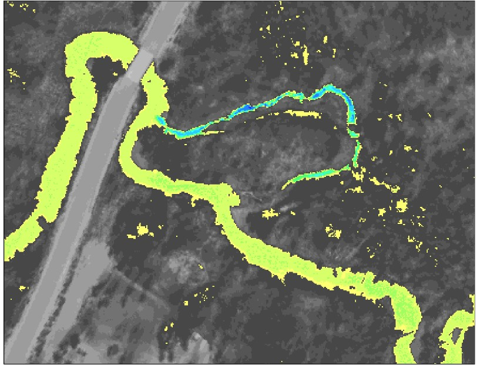
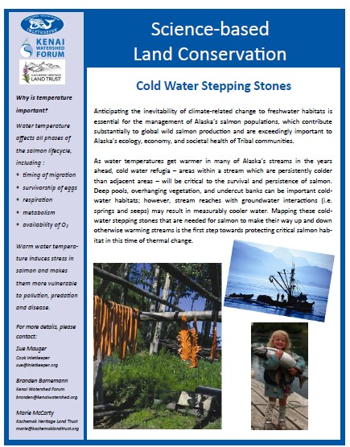

# Introduction

```{r , include=FALSE}
knitr::opts_chunk$set(echo = TRUE, warning = F, message = F)

# clear environment
rm(list=ls())

# load packages
library(bookdown)
library(tinytex)
library(tidyverse)
library(googlesheets4)
library(lubridate)
library(readr)
library(readxl)
library(writexl)
library(hms)
library(plotly)
library(DT)
library(xlsx)
library(leaflet)
library(DT)
library(ggpubr)
library(plotrix)
library(packrat)
library(foreign)

# set plotting themes

## geom_col plots theme
col_theme <- theme(axis.title = element_text(size = 14, face = "bold"),
                   strip.text = element_text(size = 14, face = "bold"),
                   legend.title = element_text(size = 14, face = "bold"),
                   legend.text = element_text(size = 14),
                   axis.text = element_text(size = 14))

## geom_points plots theme
points_theme <- theme(axis.title = element_text(size = 14, face = "bold"),
                   strip.text = element_text(size = 14, face = "bold"),
                   legend.title = element_text(size = 14, face = "bold"),
                   legend.text = element_text(size = 14),
                   axis.text = element_text(size = 11, face = "bold"),
                   title = element_text(size = 18))

# function to exclude multiple items per column
'%ni%' <- Negate('%in%')

# clarify select function
select <- dplyr::select
```

```{r TIR-fig, echo = F, fig.cap = "Example of airborne thermal infrared imagery showing temperature contrast in a stream near a road crossing", out.height=300, out.height=300}



```

This document contains preliminary data and analysis related to the Kenai River Thermal Imagery project. This work is a collaborative effort between three Kenai Peninsula Nonprofits: Cook Inletkeeper, Kachemak Bay Heritage Land Trust, and Kenai Watershed Forum.

A two-page project summary titled, "Science Based Land Conservation: Cold Water Stepping Stones" is outlined below. A full size version of this information sheet is accessible at this link: [Project Summary Sheet Link](https://github.com/Kenai-Watershed-Forum/kenai_thermal_imagery/blob/master/documents/Kenai%20Thermal%20Imagery%20Project%20Overview%202021.pdf).

All code used to generate this report is available in the project's GitHub repository at <https://github.com/Kenai-Watershed-Forum/kenai_thermal_imagery>.

```{r , echo = F, fig.cap = "Project summary sheet", out.width=400, out.height=500}



```

```{r include=FALSE}
# automatically create a bib database for R packages
knitr::write_bib(c(
  .packages(), 'bookdown', 'knitr', 'rmarkdown'
), 'packages.bib')
```
